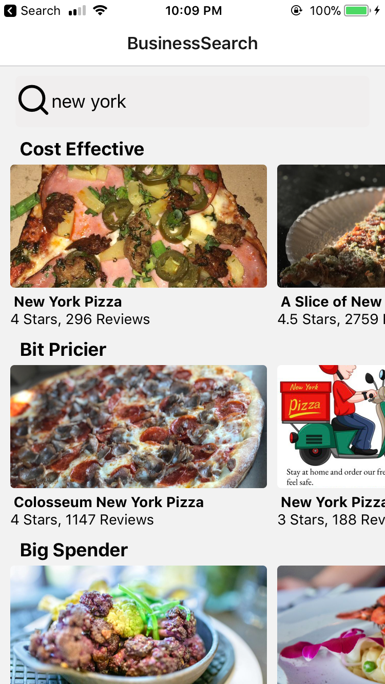

# Yelp_Test_React
* This app followed Udemy class The Complete React Native + Hooks Course [2020 Edition]
* This app uses yelp api to display restaurants based on location search results and grouped by price. 
* Add a yelp.js file into api folder with the following code. Replace YourKey with your API key from yelp:

import axios from 'axios';

export default axios.create({
    baseURL: 'https://api.yelp.com/v3/businesses',
    headers:{
        Authorization: 'Bearer YourKey'
    }
});

     

